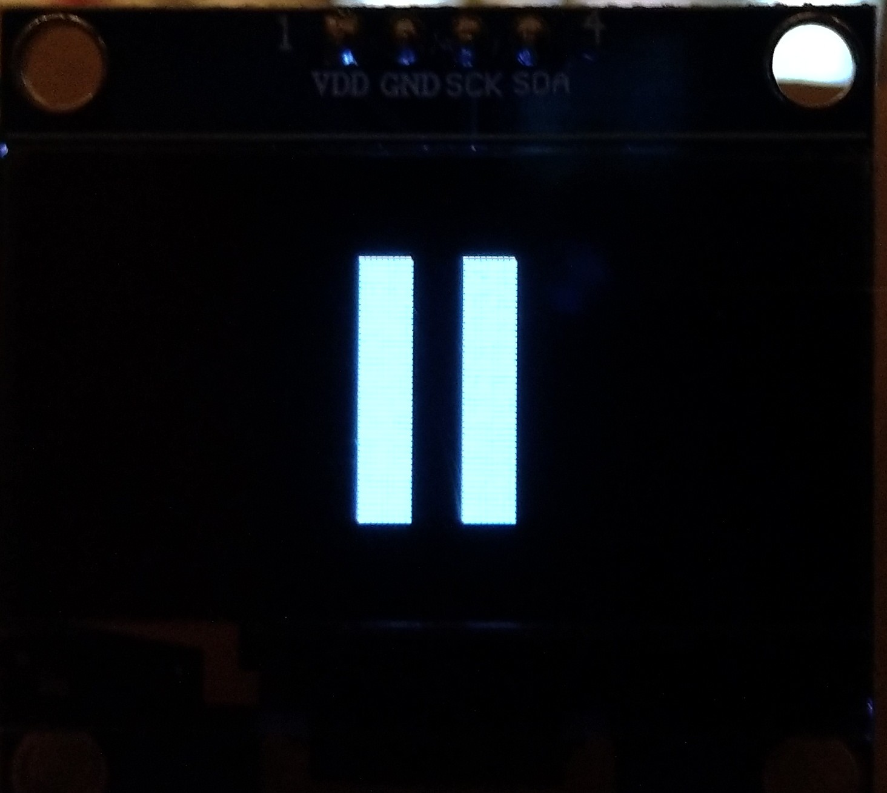
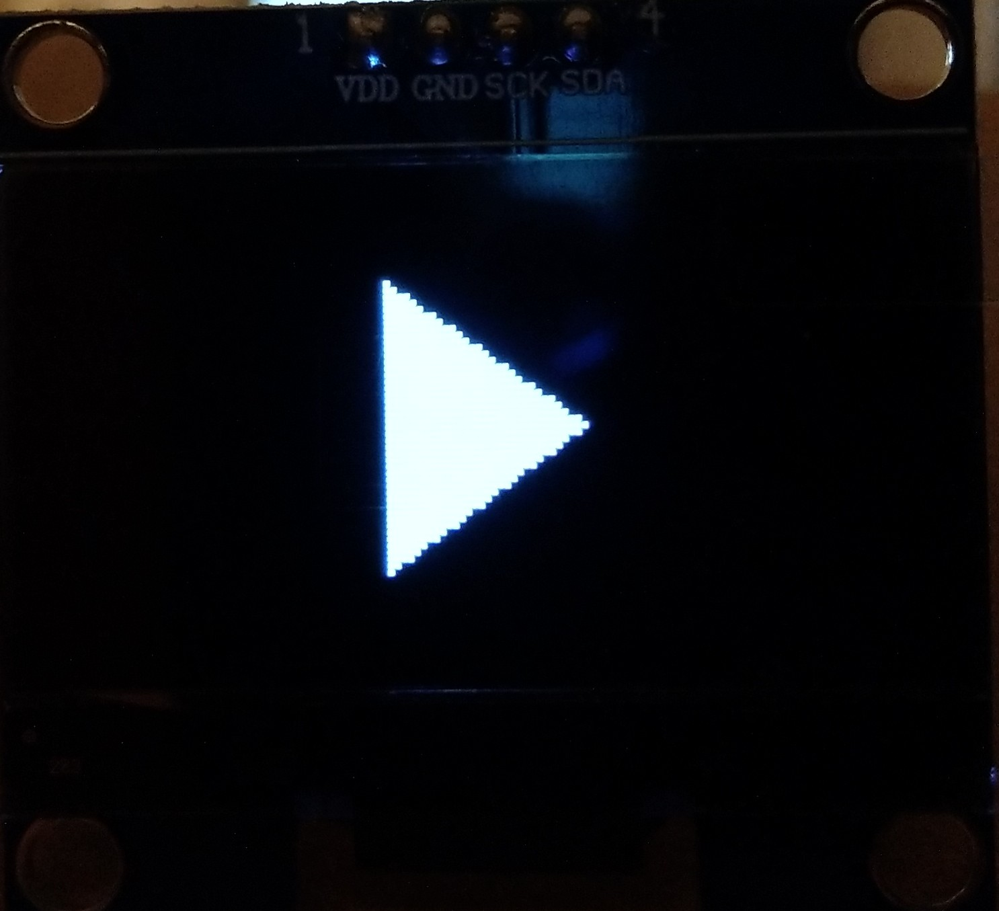
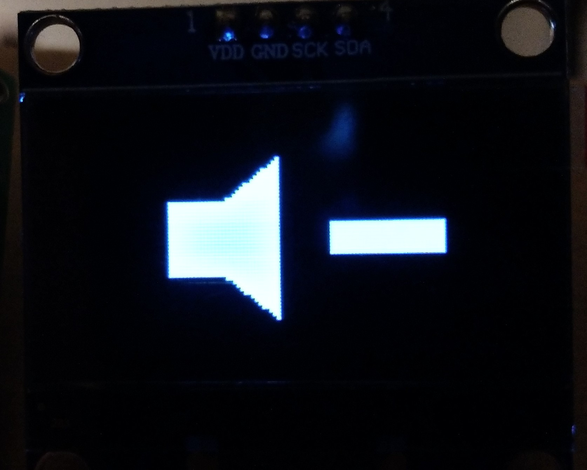

Date: 24.12.2018

# oled_phoniebox
oled_phoniebox
Based on https://github.com/rm-hull/luma.oled

Tested with this display (affiliate Link): <a href="https://amzn.to/2SjPFPt" target="_blank">https://amzn.to/2SjPFPt</a>

| Start Screen | Play View | Play Screen | Vol Down Screen | Vol Up Screen |
ause Screen
| --- | --- | --- | --- | --- | --- |
|  |  |  |  |  |  |

<a href="https://youtu.be/KXVeuthe45w" target="_blank">German Youtube Video</a>

## Installation Steps

### Installation I2C
Please follow these Instructions: https://learn.adafruit.com/adafruits-raspberry-pi-lesson-4-gpio-setup/configuring-i2c

### Deactivate Buttons
It is possible, that the Display uses the same GPIO like the Shut-Command of the jukebox4kids. In this case, you should edit the file gpio-buttons.py like this
> sed -i -e "s:shut = Button(3, hold_time=2):#shut = Button(3, hold_time=2):g" ~/RPi-Jukebox-RFID/scripts/gpio-buttons.py

### Service Installation
1. Login as User pi
2. sudo apt install -y git 
3. sudo git clone https://github.com/splitti/oled_phoniebox ~/oled_phoniebox
4. cd ~/oled_phoniebox
5. sudo chmod 777 setup.sh
6. sudo ./setup.sh

## Some other Information
Image: https://pixabay.com/de/noten-musik-melodie-musiknote-2570451
Font: https://www.dafont.com/pixel-arial-11.font
GPIO-Config for jukebox4kids: https://github.com/MiczFlor/RPi-Jukebox-RFID/blob/master/docs/GPIO-BUTTONS.md
